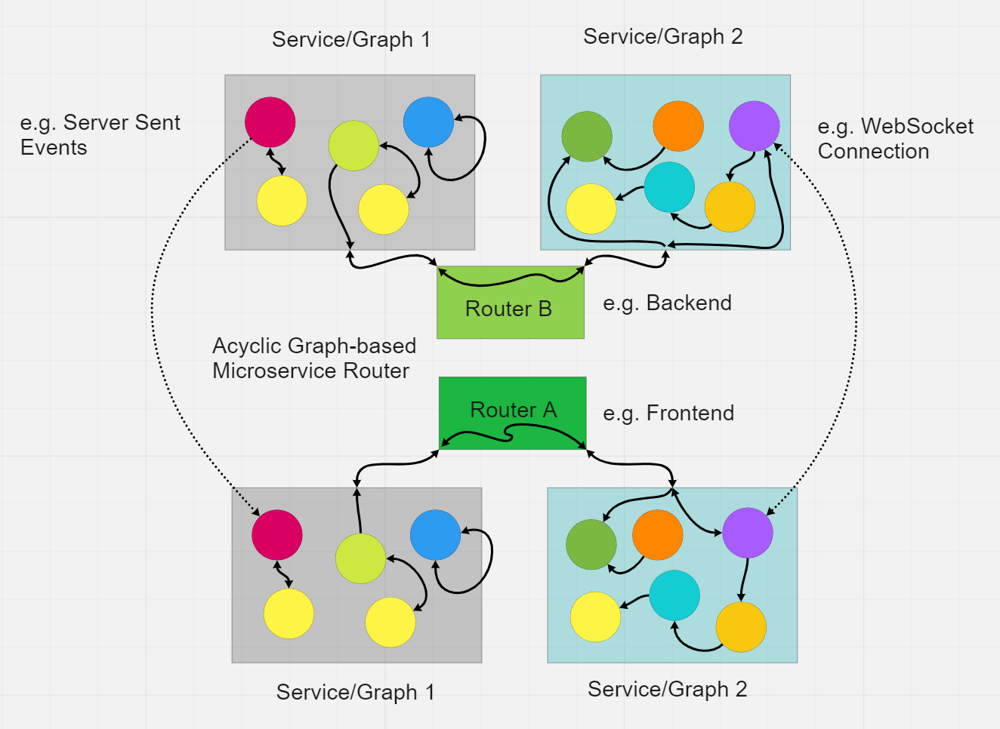

# graphscript

`npm i graphscript`

For node.js
`npm i graphscript-node`

For happy code!

# READMEs (WIP):
We are still in alpha so docs aren't the priority yet.

## * [Graph](./docs/Graph.md)
## * [Service](./docs/Service.md)
## * [Router](./docs//Router.md)

This is the new Brains@Play core, which seeks to be a true graph based programming api and unified interface for microservices and otherwise automating major frontend and backend execution needs with minimal mental work (once you learn the basics).

Joshua Brewster and Garrett Flynn

AGPL v3.0 License (copyleft)
