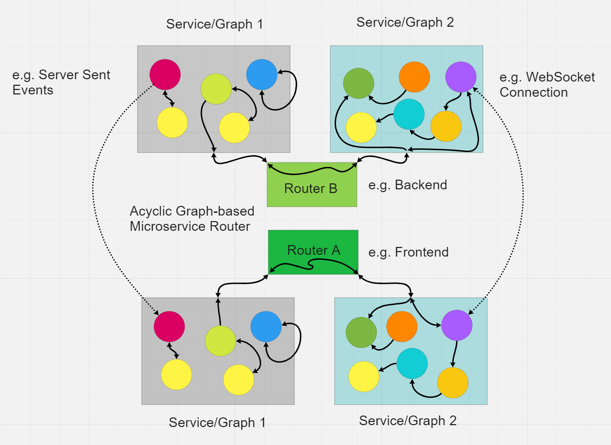

# Graphs

The Graph and GraphNode classes are an implementation of the acyclic graphs and node-based hierarchical programming. Best jargon I could come up with is that this is an "object-oriented functional programming" approach to a generalized javascript programming API. 




The Graph handles synchronous and asynchronous programming approaches as you need them, including flowgraph execution and inbuilt loops, animations, recursion, forward and backprop, and dynamic node generation with simple objects or straight functions with minimal specification and any properties and arguments you want.

If that sounds like a lot, we took this a few steps further with the higher level [Service](./Service.md) and [Router](./services/router/Router.md) implementations to enable interoperable programming and one-liner pipes through networking protocols, web workers, peer 2 peer connections. This let's you focus more on creating more robust, performant, and dynamic application and computation pipelines. This even includes unified end 2 end encryption pipes to simplify app security with common accepted standards like AES. 

To make the best use of this API it's important to have strong concepts of scoping, sync/async/promises, threading, and basic javascript object usage and referencing. This adds up to a minimal [finite state machine](https://en.wikipedia.org/wiki/Finite-state_machine) architecture optimized for performance and minimal abstraction for automating your javascript workflow.

### GraphNode class

These are the objects created to represent each node in the tree. They can be created without belonging to a graph. The graph simply makes it easier to instantiate and index nodes. 

Every node shares a state with a common state object that allows for quick subscription for function outputs across your graph/tree. Access this feature simply by calling .subscribe on a node or on the graph class where you specify the node by tag.

GraphNode properties
```ts


export type OperatorType = ( //can be async
    ...args:any //input arguments, e.g. output from another node
)=>any|void


//properties input on GraphNode or add, or for children
export type GraphNodeProperties = {
    tag?:string, //generated if not specified, or use to get another node by tag instead of generating a new one
    
    operator?:OperatorType|((...args)=>any|void), //Operator to handle I/O on this node. Returned inputs can propagate according to below settings
    
    forward?:boolean, //pass output to child nodes
    
    backward?:boolean, //pass output to parent node
    
    children?:{[key:string]:string|boolean|undefined|GraphNodeProperties|GraphNode|Graph}//string|GraphNodeProperties|GraphNode|(GraphNodeProperties|GraphNode|string)[], //child node(s), can be tags of other nodes, properties objects like this, or GraphNodes, or null
    
    parent?:GraphNode|Graph, //parent graph node
    
    branch?:{ //based on the operator result, automatically do something
        [label:string]:{ //apply any label for your own indexing
            if:any|((output:any)=>boolean), //if this value, or pass a callback that returns true/false
            then:string|((...operator_result:any[])=>any)|GraphNode //then do this, e.g. use a node tag, a GraphNode, or supply any function
        } //it still returns afterward but is treated like an additional flow statement :D. GraphNodes being run will contain the origin node (who had the branch)
    },
    
    reactive?:boolean|((_state:{[key:string]:any})=>void), //use a local state object to trigger state subscriptions, using the node's _unique tag for subscribing on global state

    tree?:Tree, //can also declare independent node maps on a node for referencing
    
    delay?:false|number, //ms delay to fire the node
    
    repeat?:false|number, // set repeat as an integer to repeat the input n times, cmd will be the number of times the operation has been repeated
    
    recursive?:false|number, //or set recursive with an integer to pass the output back in as the next input n times, cmd will be the number of times the operation has been repeated
    
    frame?:boolean, //true or false. If repeating or recursing, execute on requestAnimationFrame? Careful mixing this with animate:true
    
    animate?:boolean, //true or false, run the operation on an animationFrame loop?
    
    loop?:false|number, //milliseconds or false, run the operation on a loop?
    
    animation?: OperatorType, //if it outputs something not undefined it will trigger parent/child operators
    
    looper?: OperatorType, //if it outputs something not undefined it will trigger parent/child operators
    
    oncreate?:(self:GraphNode|any,...args:any[])=>void, //do something after _initializing the node, if loaded in a graph it only runs after setTree
    
    ondelete?:(self:GraphNode|any,...args:any[])=>void, //do something after deleting the node
    
    DEBUGNODE?:boolean, // print a console.time and the result for a node by tag, run DEBUGNODES on a GraphNode or Graph to toggle debug on all attached nodes.
    
    [key:string]:any //add whatever variables and utilities, if reactive is true or a callback, you can subscribe to updates whenever these properties change

}; //can specify properties of the element which can be subscribed to for changes.


type Tree = {
    [key:string]: //the key becomes the node tag on the graph
        GraphNode |
        Graph | //special nodes, the graph will live on the .source property of this node and the operator accepts objects with key:value pairs to run functions on the graph and return a results object with corresponding key:value pairs.
        GraphNodeProperties |
        OperatorType |
        ((...args)=>any|void) |
        { aliases:string[] } & GraphNodeProperties
}

```

GraphNode utilities

```js

    //node properties you can set, create a whole tree using the children
    let props={
        operator:(
            ...args    //e.g. 'loop' or 'animate' will be defined if the operator is running on the loop or animate routines, needed something. Can define more commands but you might as well use an object in input for that. 
        )=>{ console.log(args); return args; }, //Operator to handle I/O on this node. Returned inputs can propagate according to below settings
        forward:true, //pass output to child nodes
        backward:false, //pass output to parent node
        children:undefined, //child node(s), can be tags of other nodes, properties objects like this, or graphnodes, or null
        parent:undefined, //parent graph node
        branch:undefined,  //based on the operator result, automatically do something
        tree:undefined,
        delay:false, //ms delay to fire the node
        repeat:false, // set repeat as an integer to repeat the input n times
        recursive:false, //or set recursive with an integer to pass the output back in as the next input n times
        frame:false, //true or false. If repeating or recursing, execute on requestAnimationFrame? Careful mixing this with animate:true
        reactive:undefined, //subscribe to unique props changes (not including these props)
        animate:false, //true or false
        animation:undefined, //independent animation function from main operator?
        loop:undefined, //milliseconds or false
        looper:undefined, //independent looping function from main operator?
        tag:undefined, //generated if not specified, or use to get another node by tag instead of generating a new one
        DEBUGNODE:false // print a console.time and the result for a node by tag, run DEBUGNODES on a GraphNode or Graph to toggle debug on all attached nodes.
      }; //can specify properties of the element which can be subscribed to for changes.


let node = new GraphNode(props, parentNode, graph);

node
    .run(...args) //<--- this is the base sequencing function.  If any async or flow logic is being used by the node, it returns a promise which can be awaited to get the final result of the tree. Else it returns a synchronous operation for speed. Subscriptions to async nodes will fire after the promise resolves otherwise

    .runAsync(...args) //force the operation to run as a promise for cleaner chaining

    .runAnimation(animation=this.operator,node=this,args=[]) //run the operator loop on the animation loop with the given input conditions, the cmd will be 'animate' so you can put an if statement in to run animation logic in the operator

    .runLoop(looper=this.operator,node=this,args=[]) //runs a setTimeout loop according to the node.loop setting (ms)

    .setOperator(operator) //set the operator functions

    .setParent(parent) //set the parent GraphNode

    .operator(...args) //<--- runs the operator function
    
    .runOp(...args) //<--- runs the operator and sets state with the result for that tag. Returns a promise if the operator is an async function.
    
    .addChildren(children:{}) //add child GraphNodes to this node (operation results passed on forward pass)

    .subscribe(callback=(res)=>{},tag=this.tag) //subscribe to the tagged node output, returns an int. if you pass a graphnode as a callback it will call subscribeNode
 
    .unsubscribe(sub,tag=this.tag) //unsubscribe from the tag, no sub = unsubscribe all

    .subscribeNode(node) //subscribe another node sequence (not a direct child) to this node's output via the state

    .removeTree(node) //remove a node and all associated nodes

    .add(props) //add a node using a properties object

    .append(props, parentNode=this) //append a child node with a properties object or string

    .remove(node) //remove a node reference from this node and any nodes indexed in this node

    .stopLooping() //stop the loop

    .stopAnimating() //stop the animation loop

    .stopNode() //stop both

    .convertChildrenToNodes(node=this) //convert child node properties objects/tags/etc to nodes.

    .callParent(...args) //run the parent node operation (no propagation)

    .callChildren(idx?, ...args) //call the children node(s) with the given input, won't run their forward/backward passes. Can specify children by index as well

    .setProps(props) //assign to self, will trigger the runSync checks again

    .print(node=this,printChildren=true) //recursively print a reconstrucible json hierarchy of the graph nodes, including arbitrary keys/functions, if printChildren is set to false it will only print the tags and not the whole object in the .children property of this node

    .reconstruct(json='{}') //reconstruct a jsonified node hierarchy into a functional GraphNode tree and add it to the list

```


### Acyclic Graph Utilities

```js


let tree = { //you may pass an object to register a list of nodes from prototypes given here. The keys given will be the tag for the base node (parent/child prototypes need tags, else they are randomly assigned tags)
    log:(...inp)=>{
        console.log(...inp);
    },
    repeater:{
        operator:(...args) => { console.log("Reporting... ",Math.random()) },
        loop:500
    }
    animation:{
        ctx:undefined,
        width:200,
        height:200,
        operator:function anim(...args) {
            
            if(!this.ctx) {
                document.body.insertAdjacentHTML('beforeend',`<canvas id='square' width='${this.width}px' height='${this.height}px' style='width:${this.width}px; height:${this.height}px;'></canvas>`);
                let square = document.getElementById('square');
                this.ctx = square.getContext('2d'); 
            }
            
            this.ctx.clearRect(0,0,this.ctx.canvas.width,this.ctx.canvas.height);
            
            this.ctx.fillStyle = `#00${Math.floor(Math.sin(performance.now()*0.001)*89+10)}00`;

            this.ctx.fillRect(0,0,this.ctx.canvas.width,this.ctx.canvas.height);
            
        }
        animate:true
        //animation:(...args)=>{} //can also use this and set the operator as a separate function to modify the node e.g. to control an animation with graph-based controls
    }
} 

//this is less useful now that the graph nodes are self contained but it can act as an index for your node trees.
let graph = new Graph(tree);

    graph

        .setTree(tree) //apply a tree object to the graph to instantiate a bunch of nodes and append the existing tree with more methods

        .add(node) // add a node with a properties object

        .get(tag) // get a node by tag, nodes added in the acyclic graph automatically get their tags set to sequential numbers if not set otherwise

        .set(node) //set a node by node.tag

        .run(node,...args) //<--- runs the node sequence starting from the given node, returns a promise that will spit out the final result from the tree if any

        .runAsync(node,...args) //force the operation to return as a promise for cleaner chaining

        .removeTree(node) // remove a node tree by head node

        .remove(node) // remove a node and any references

        .append(node, parentNode) // append a node to a parent node

        .callParent(node, ...args) // call a parent ndoe of a given node

        .callChildren(node, ...args) // call the children of a given node

        .subscribe(tag, callback=(res)=>{}) //subscribe to a node tag, callbacks contain that node's operator output, returns an int sub number

        .unsubscribe(tag, sub) //unsubscribe to a node by tag, 

        .subscribeNode(inputNode,outputNode) //subscribe the outputNode to the output of the inputNode

        .print(node,printChildren=true) //recursively print a reconstrucible json hierarchy of the graph nodes, including arbitrary keys/functions, if printChildren is set to false it will only print the tags and not the whole object in the .children property of this node

        .reconstruct(json='{}') //reconstruct a jsonified node hierarchy into a functional GraphNode tree

        .create(operator,parentNode,props) //create a node from this recipe

```


### Basic usage
(need to make a less useless example)
```js

const tree = {
    add:(a=0,b=0)=>{
        return a+b;
    },
    square:(c)=>{
        return c*c;
    },
    log:(...args)=>{
        console.log('LOG:',...args);
    },
    sequence:{
        result:undefined,
        operator:(input1,input2)=>{
            this.result = [input1,input2];
            return this.result;
        },
        children:{
            'add1':{ 
            tag:'add'//you may construct graphs just by naming existing nodes you want to pipe data through. It will look for them on the graph or in the nodes if the tagged nodes are declared later
            children:{
                'square1':{
                    tag:'square', //source this node definition
                    children:{
                        'log':true, //run a log on parent output
                        'square2':{
                            tag:'square', //source this node
                            children:[ 'log', (output)=>{ this.graph.get('sequence').result = output;  }]
                        }
                    }
                }
            }
        }
    }
}

const graph = new Graph(tree,'graph1',undefined);

graph.run('sequence',21,23).then((res) => {
    console.log(res);
    console.log(graph.get('sequence').result);
});

```